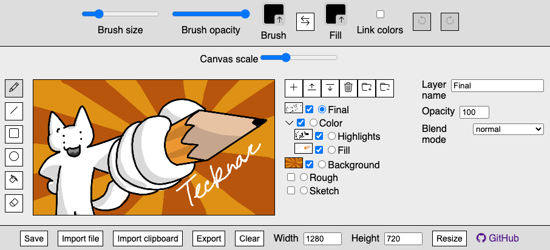

# Tecknar
Tecknar ([the Swedish present indicative for "to draw"](https://en.wiktionary.org/wiki/teckna#Swedish)) is a simple, embeddable drawing program for whatever website you're running. It is currently in a testing phase.



Try it out for yourself at https://aadenboy.github.io/tecknar/!

## Installation
Include all files found in the `src/` directory in your project. Then, in any script:

```js
const canvas = new Tecknar();
canvas.mount(object);
```

You can export the data from the canvas at any time either by using `Tecknar.export()` or through `Tecknar.data` assuming it is up-to-date.

### Parameters
The constructor takes two objects which correspond to Tecknar's settings (configurational data) and options (what is/isn't present).

```js
  /*
    settings (object): a set of settings for the canvas
      - width (int): the initial width of the canvas (default 250)
      - height (int): the initial height of the canvas (default 200)
      - maxLayers (int): the maximum number of layers (default 256)
      - maxBrushSize (int): the maximum brush size (default 50)
      - minWidth (int): the minimum width of the canvas (default 1)
      - minHeight (int): the minimum height of the canvas (default 1)
      - maxWidth (int): the maximum width of the canvas (default 10000)
      - maxHeight (int): the maximum height of the canvas (default 10000)
      - maxUndo (int): the maximum number of undo states (default Infinity)
        > if memory is a concern, you may want to limit this, otherwise I don't think it really matters?
        * note: clearing and importing add to the undo stack rather than replacing it
      - keybinds (object): a list of keybinds to use. chord multiple keys with a plus sign. ctrl also responds to cmd
        - pen: pen tool (default "p")
        - line: line tool (default "l")
        - rect: rectangle tool (default "r")
        - circle: circle tool (default "o")
        - fill: fill toggle (default "f")
        - erase: erase toggle (default "e")
        - swapColors: swap colors (default "x")
        - linkColors: link colors (default "shift+x")
        - undo: undo (default "ctrl+z")
        - redo: redo (default "ctrl+shift+z")
        - clear: clear (default "ctrl+shift+c")
        - save: save (default "ctrl+s")
        - import: import (default "ctrl+v")
          > uses clipboard
        - export: export (default "ctrl+c")
          > uses clipboard
        - resize: resize (default "ctrl+shift+r")
        - addLayer: add layer (default "ctrl+l")
        - removeLayer: remove layer (default "ctrl+backspace")
        - layerUp: move layer up (default "ctrl+up")
        - layerDown: move layer down (default "ctrl+down")
        - toggleLayer: toggle layer visibility (default "ctrl+shift+v")
        - selectNext: select next layer (default "ctrl+]")
        - selectPrevious: select previous layer (default "ctrl+[")
        - groupLayer: group layer (default "ctrl+g")
        - ungroupLayer: ungroup layer (default "ctrl+shift+g")
          > this applies to the parent group if there is one
      - useDouglasPeucker (boolean): whether to use the Douglas-Peucker algorithm (default true)
        > this is used to simplify strokes for better compression, but may be disabled if you want to keep the original points
      - dpDelta (float): the delta for the Douglas-Peucker algorithm (default 0.5)
        > this is the maximum distance a point can be from the line between two points to be considered a vertex
        > 0.5 is entirely arbitrary (half of a pixel in this case)
      - compressionLevel (0-9): the compression level for the canvas (default 6)
        > this directly corresponds to zlib compression levels. 0 is no compression, 9 is maximum compression
        > 6 is the default used by pako
    options (object): a set of which options to enable
      - tools (boolean/object): tools to enable, or a boolean to specify all or none (default true)
        - pen: enable pen tool (default true)
        - line: enable line tool (default true)
        - rect: enable rectangle tool (default true)
        - circle: enable circle tool (default true)
      - toggles (boolean/object): toggles to enable, or a boolean to specify all or none (default true)
        - fill: enable fill toggle (default true)
        - erase: enable erase toggle (default true)
      - colors: (boolean/object): color pickers to enable, or a boolean to specify all or none (default true)
        - brush: enable brush color picker (default true)
        - fill: enable fill color picker (default true)
          * note: this only applies if fill is enabled. if disabled, fill uses the brush color
          > for ux reasons this is disabled if brush color is disabled
      - layers (boolean): enable layer layers (default true)
      - layerOptions (boolean/object): layer options to enable, or a boolean to specify all or none (default true)
        * note: this only applies if layers is enabled
        * note: disabling layer options also disables layer groups
        - name: enable layer name (default true)
        - opacity: enable layer opacity (default true)
        - blend: enable layer blending modes (default true)
      - clear (boolean): enable clear button (default true)
        > might not be the best idea to disable this
      - history (boolean): enable undo/redo (default true)
      - brushSize (boolean): enable brush size slider (default true)
      - brushOpacity (boolean): enable brush opacity slider (default true)
        * note: this only applies if brushColor is enabled
        > this controls the entire opacity of the stroke itself rather than the colors
        > color opacity allows the stroke and fill color to overlap each other, while brush opacity groups them together
      - save (boolean): enable save button (default true)
        > it may be handy to enable this!
      - saveTKA (boolean): enable saving as a .tka file (default true)
        * note: this only applies if save is enabled
      - saveJSON (boolean): enable saving as a .json file (default true)
        * note: this only applies if save is enabled
      - porting (boolean): enable import and export buttons (default true)
        > it may be handy to enable this!
      - resize (boolean): enable resizing (default true)
  */
```

## License
Bootstrap Icons is from https://github.com/twbs/icons, and is under the MIT license.

pako.js is from https://github.com/nodeca/pako, and is under the MIT license.

jscolorpicker is from https://github.com/wipeautcrafter/jscolorpicker, and is under the MIT license.

Tecknar itself is under the MIT license.
